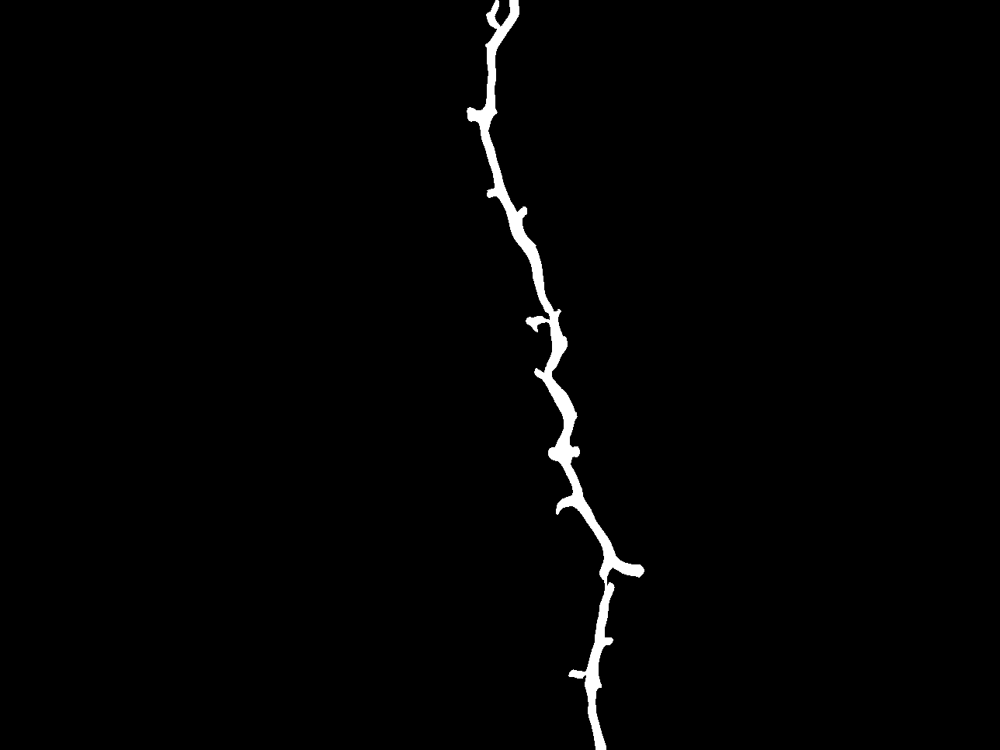
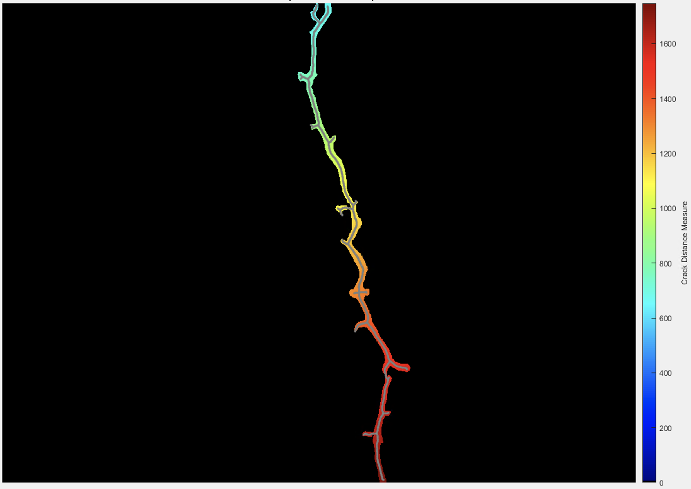
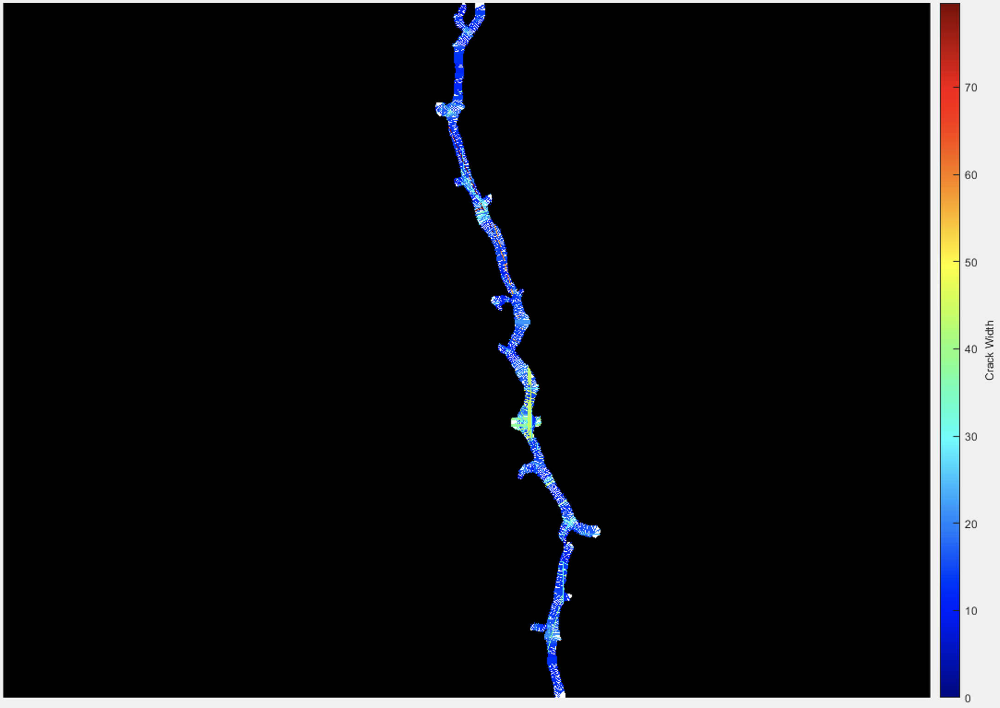

# Introduction

Calculates the crack width based on the ellipse major axis orientation and Bresanham line traversing and follows a comprehensive visualization code.

# Quick Pipeline Visualization
## Example: Cylindrical and spherical projections
| Crack image | Distance map | Crack width |
| ------------- | ------------- | ------------- |
|  |  |  |

# Requirements
MATLAB

# Feedback
Please rate and provide feedback for the further improvements.
